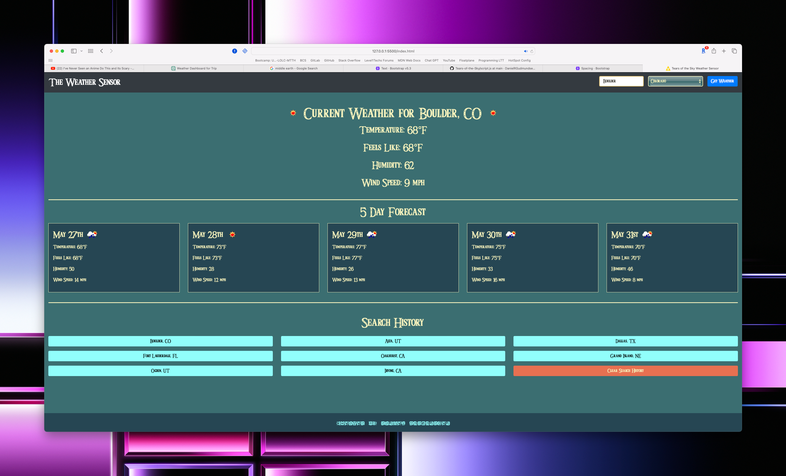

# Tears of the Sky - Weather Sensor

The Weather Sensor is a weather application that provides the current weather conditions and a 5-day forecast for a specified city within the United States. The application leverages the OpenWeatherMap API to gather weather data, and the Google Geocoding API to validate and get accurate coordinates for a given city and state. The application also maintains a search history that allows users to re-fetch weather data for previously searched locations.

##Features

- **Search by City and State**: Users can enter a city and select a state within the U.S to fetch the weather data.
- **Current Weather Display**: The application displays the current weather conditions including temperature, 'feels like' temperature, humidity, and wind speed.
- **5-Day Forecas**t: The application provides a 5-day forecast, showing similar weather data to the current conditions for each day.
- **Search History**: The application maintains a search history, saving the most recent 30 searches and displays them as clickable buttons to easily re-fetch the weather data.
- **Data Validation**: The Google Geocoding API is used to verify that the city and state entered by the user are valid and correctly spelled.
- **Custom Fonts**
    - Triforce: 'Triforce' is a custom font family that is loaded from the 'Triforce.eot', 'Triforce.woff2', 'Triforce.woff', 'Triforce.ttf', and 'Triforce.svg' files.
    - BotW Sheikah: 'BotW Sheikah' is another custom font family that is loaded from the 'BotWSheikahRegular.eot', 'BotWSheikahRegular.woff2', 'BotWSheikahRegular.woff', 'BotWSheikahRegular.ttf', and 'BotWSheikahRegular.svg' files.

## Technologies Used

- **HTML**: HTML5 is used for structuring the content of the webpage.
- **CSS**: CSS3 and Bootstrap 4.5.2 are used for styling the webpage. 
- **JavaScript and jQuery**: JavaScript ES6 and jQuery 3.6.0 are used for handling events, fetching data from APIs, and dynamically updating the HTML content.
- **Google Geocoding API**: Used to verify city and state names entered by users, and to fetch coordinates for making API calls to OpenWeatherMap.
- **OpenWeatherMap API**: Used to fetch weather data for a given city.
- **Local Storage**: Used for persisting the search history across multiple sessions.

## Known Issues

If the OpenWeatherMap API or the Google Geocoding API are not available or return errors, the application will not be able to fetch or display weather data. Errors are logged to the console for debugging.

## Future Enhancements

- Expand the application to support locations outside the United States.
- Enhance the error handling to display user-friendly error messages on the webpage.
- Allow users to customize their experience (e.g., choose between Fahrenheit and Celsius, choose between a 5-day and 7-day forecast, etc.).

## Link to deployed application

[The Weather Sensor](https://danielrgudmundsen.github.io/Tears-of-the-Sky/)
